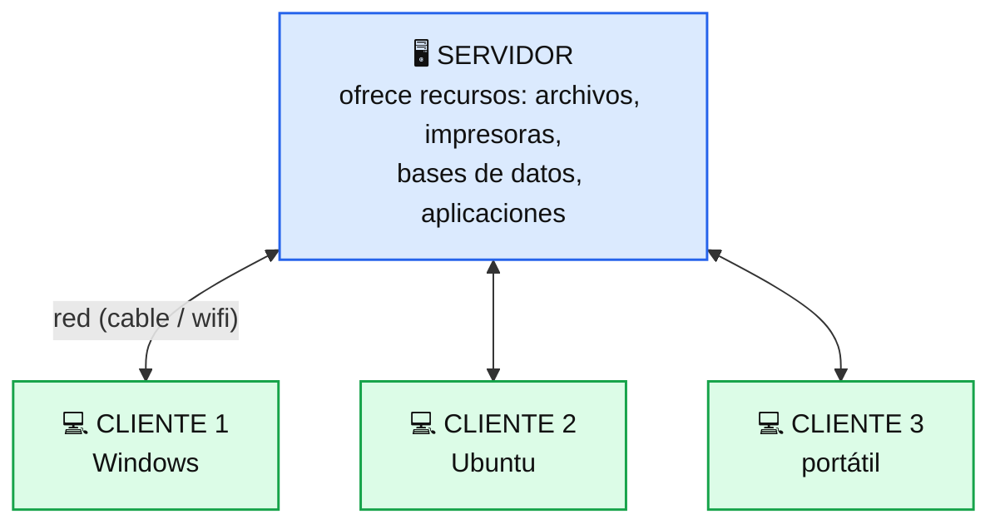
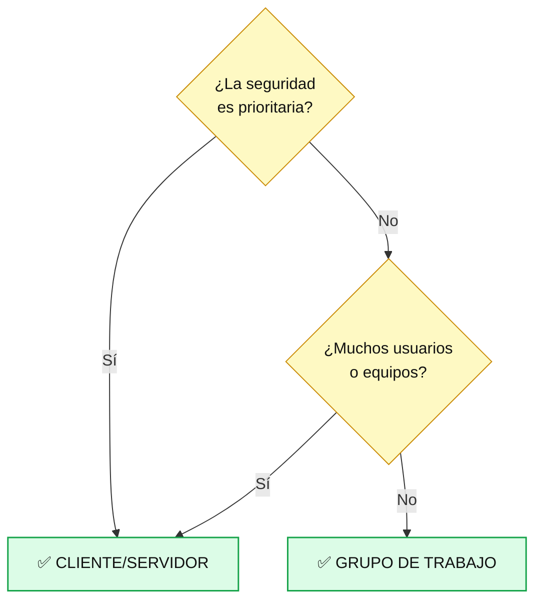
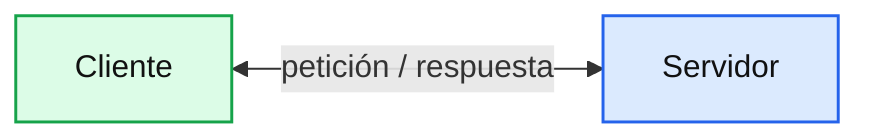
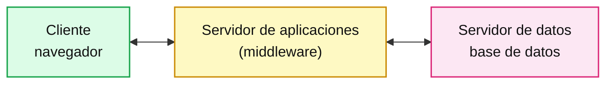
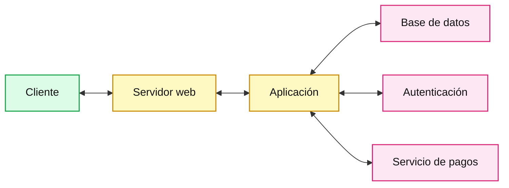

# Tema 1 — Introducción a los Sistemas Operativos en Red

---

## Índice

1. [Introducción y contextualización práctica](#1-introducción-y-contextualización-práctica)
2. [¿Qué es un SO en red?](#2-qué-es-un-so-en-red)
   - 2.1. [Características de los sistemas operativos en red](#21-características-de-los-sistemas-operativos-en-red)
   - 2.2. [¿Cómo elegir un SO en red?](#22-cómo-elegir-un-so-en-red)
3. [Arquitectura cliente/servidor](#3-arquitectura-clienteservidor)
   - 3.1. [Funciones de los elementos cliente/servidor](#31-funciones-de-los-elementos-clienteservidor)
   - 3.2. [Tipos de arquitectura cliente/servidor](#32-tipos-de-arquitectura-clienteservidor)
4. [SO en red del mercado](#4-so-en-red-del-mercado)
5. [Windows Server](#5-windows-server)
6. [Ubuntu Server](#6-ubuntu-server)
7. [Otros SO en red](#7-otros-so-en-red)
8. [Comprobación de requisitos hardware y software](#8-comprobación-de-requisitos-hardware-y-software)
9. [Requisitos mínimos de instalación](#9-requisitos-mínimos-de-instalación)
10. [Resumen y resolución del caso práctico de la unidad](#10-resumen-y-resolución-del-caso-práctico-de-la-unidad)


---

## 1. Introducción y contextualización práctica

Cuando abres una carpeta que está en otro ordenador, imprimes en una impresora de la oficina o inicias sesión con tu usuario en cualquier equipo, estás usando un **SO en red**. En este tema aprendes a **decidir** si hace falta un servidor, **elegir** el sistema y **comprobar** que el equipo lo aguanta, antes de instalar nada.

---

## 2. ¿Qué es un SO en red?

Sistema operativo que permite **conectar equipos (por cable o wifi) para compartir recursos** de hardware y software: archivos, impresoras, bases de datos, aplicaciones.



- **Cliente:** equipo que se conecta al servidor para usar sus recursos.
- **Servidor:** equipo que **proporciona, distribuye y almacena** recursos.

> 💡 Cliente y servidor son **roles**, no tipos de máquina: un mismo equipo puede ser ambos.

### 2.1. Características de los sistemas operativos en red

Incluyen **seguridad** (usuarios, contraseñas, control de acceso remoto) y una **interfaz de gestión** para el administrador. Sus funciones:

- Controlar los accesos a los recursos.
- Ofrecer comunicación entre dispositivos.
- Monitorizar la red y solucionar problemas.
- Configurar y administrar los recursos.

### 2.2. ¿Cómo elegir un SO en red?

**Paso 1 — ¿Necesito un servidor?**

Para decidir si hace falta un SOR se identifica si se trabajará con una arquitectura en red de **grupo de trabajo** o de **cliente/servidor**:

- **Grupo de trabajo:** forma de organizar equipos en red en la que **no existe un servidor central**. Los equipos comparten recursos entre sí y cualquiera puede actuar como cliente y como servidor.
- **Cliente/servidor:** hay uno o varios servidores que centralizan recursos, usuarios y seguridad; los demás equipos son clientes.

| | Grupo de trabajo | Cliente/servidor |
|---|---|---|
| **Servidor central** | No | Sí |
| **Cuentas de usuario** | Cada equipo gestiona las suyas | Centralizadas en el servidor |
| **Seguridad** | Básica | Alta, con control central de accesos |
| **Administración** | Equipo a equipo | Centralizada |
| **Nº de equipos / usuarios** | Pocos | Muchos (y con posibilidad de crecer) |
| **Coste y mantenimiento** | Bajo | Mayor (servidor, licencias, administración) |

Tres criterios para decidir:



**Paso 2 — Elegir el sistema:** valora estos **10 factores**.

| Factor | Pregúntate... |
|---|---|
| 1. Seguridad | ¿Qué datos protege? |
| 2. Propietario o libre | ¿Soporte del fabricante o código abierto? |
| 3. Licencia | ¿Cuánto cuesta (servidor y clientes)? |
| 4. Funciones y servicios | ¿Trae lo que necesito? |
| 5. Fiabilidad | ¿Aguanta sin caídas? |
| 6. Escalabilidad | ¿Podrá crecer? |
| 7. Rendimiento | ¿Rinde con mi carga? |
| 8. Facilidad de uso | ¿Sé administrarlo (gráfico o terminal)? |
| 9. Compatibilidad con aplicaciones | ¿Funcionan mis programas? |
| 10. Requisitos de hardware | ¿Lo soporta mi equipo? |


**Paso 3 - Propietario frente a libre**

| | Propietario (p. ej. Windows Server) | Libre (p. ej. Ubuntu Server) |
|---|---|---|
| **Licencia** | De pago | Gratuita, sin licencia por uso |
| **Código fuente** | Cerrado | Abierto |
| **Soporte** | Del fabricante | De la comunidad; soporte comercial opcional |
| **Administración habitual** | Interfaz gráfica muy presente | Terminal (modo texto) |

---

## 3. Arquitectura cliente/servidor

Modelo en el que los **clientes solicitan servicios** y los **servidores los prestan**.

| Elemento | También llamado | Qué es |
|---|---|---|
| **Cliente** | *front-end* | Lo que ve el usuario (interfaz). |
| **Servidor** | *back-end* | Responde a las peticiones y gestiona los recursos. |
| **Middleware** | — | Programa que corre en cliente **y** servidor y los conecta. |

> 💡 El **navegador** es el cliente. El **servidor web** (Apache, Nginx, IIS...) es el programa del servidor que devuelve las páginas.

### 3.1. Funciones de los elementos cliente/servidor

| Elemento | Funciones |
|---|---|
| **Cliente** | Interactuar con el usuario · gestionar la interfaz · hacer las peticiones · recoger y dar formato a los resultados |
| **Servidor** | Procesar las peticiones (p. ej. bases de datos) · dar formato a los datos · validar y ejecutar la lógica de la aplicación |
| **Middleware** | Interconectar sistemas distintos · hacer las aplicaciones independientes del entorno |

> 💡 Un servidor puede actuar como **cliente de otro servidor**.

### 3.2. Tipos de arquitectura cliente/servidor

**2 niveles**



**3 niveles**



**N niveles**



| Tipo | Cómo reconocerlo |
|---|---|
| **2 niveles** | El servidor atiende directamente con sus recursos. |
| **3 niveles** | Hay una capa intermedia entre el cliente y los datos. |
| **N niveles** | Varios servidores especializados que se usan entre sí. |

---

## 4. SO en red del mercado

| Sistema | Tipo | En una frase |
|---|---|---|
| **Windows Server** | Propietario (Microsoft) | Muy usado en redes de empresa con Active Directory. |
| **GNU/Linux Server** (Ubuntu Server, Debian, Red Hat, SUSE, Rocky, AlmaLinux) | Libre | Predomina en servidores web y nube. |
| **macOS Server** | Apple | Descatalogado en 2022. |
| **AIX** · **Solaris** · **HP-UX** | UNIX propietarios | Entornos empresariales específicos. |
| **Novell NetWare** | Novell | Histórico. |

**Clientes de escritorio:** Windows (10, 11...), GNU/Linux (Ubuntu, Debian...) y macOS.

> ⚠️ **CentOS Linux ya no se mantiene** (fin en 2021 y 2024); se usa Rocky Linux, AlmaLinux o CentOS Stream. Y el 88,8 % de Windows del libro (2021) es cuota de **escritorio**, no de servidores.

---

## 5. Windows Server

**Versiones:** 2012 · 2012 R2 · 2016 · 2019 · 2022 · **2025** (noviembre de 2024).

**Cómo se instala:**

| Opción | Interfaz gráfica | Cuándo |
|---|---|---|
| **Desktop Experience** | ✅ Sí | Aprender y administrar en local. |
| **Server Core** | ❌ No (comandos/PowerShell) | Menos recursos, administración remota. |
| **Nano Server** | ❌ No | Contenedores. |

**Ediciones y licencias:**

| Edición | Para | Licencia | ¿CAL? |
|---|---|---|---|
| **Datacenter** | Nube y mucha virtualización | Por núcleos | ✅ Sí |
| **Standard** | Entornos físicos o poco virtualizados | Por núcleos | ✅ Sí |
| **Essentials** | Pequeñas empresas (máx. 25 usuarios / 50 dispositivos) | De servidor | ❌ No |

> 💡 **CAL** (*Client Access License*): licencia **por cada usuario o dispositivo** que accede al servidor (no por conexión). Se paga **aparte** de la licencia del servidor y de la de Windows en cada PC.

---

## 6. Ubuntu Server

- **Gratuito**, sin licencia y sin CAL.
- Se instala **sin interfaz gráfica** (se administra por terminal).
- Los programas se instalan por **paquetes**.

| Tipo de versión | Sale | Soporte |
|---|---|---|
| **Intermedia** | Cada 6 meses | ≈ 9 meses |
| **LTS** | Cada 2 años (abril) | 5 años |

> 💡 En servidores se usa **LTS**. La actual es **26.04 LTS** (abril de 2026, soporte hasta 2031). La 20.04 del libro ya no tiene soporte estándar.

**Antes de instalar:** analiza el contexto → comprueba requisitos → elige versión.

---

## 7. Otros SO en red

| Sistema | Fabricante | Rasgo clave |
|---|---|---|
| **macOS Server** | Apple | Gestión de dispositivos Apple (descatalogado en 2022). |
| **AIX** | IBM (UNIX) | Muy centrado en seguridad. |
| **Solaris** | Sun, hoy Oracle (UNIX) | Creado en 1992; tuvo versión libre (OpenSolaris). |
| **HP-UX** | HP (UNIX) | Listas de control de acceso, autocorrección de errores. |

---

## 8. Comprobación de requisitos hardware y software

**Checklist antes de instalar un servidor:**

- ☐ ¿Para qué se va a usar? (servicios, nº de clientes)
- ☐ **Hardware:** CPU, RAM, disco y tarjeta de red suficientes
- ☐ **Controladores** disponibles para el hardware
- ☐ **Sistema operativo:** arquitectura (64 bits) y compatibilidad con las aplicaciones
- ☐ **Red:** LAN/WAN funcionando y equipos conectados y actualizados
- ☐ Identificados los equipos **servidor** y los equipos **cliente**


> 💡 En una **máquina virtual** verás los recursos que le hayas **asignado**, no los del equipo físico.

---

## 9. Requisitos mínimos de instalación

| | CPU | RAM | Disco |
|---|---|---|---|
| **Windows Server 2022** | 1,4 GHz, 64 bits | 512 MB (2 GB con interfaz gráfica) | 32 GB |
| **Ubuntu Server 20.04 LTS** | 1 GHz | 1 GB | 25 GB |

> ⚠️ **Mínimo ≠ recomendado.** El mínimo solo permite instalar y arrancar. Según la función del servidor y el número de clientes, añade recursos extra.

> 💡 Estas cifras son de las versiones del temario. **Los requisitos cambian de una versión a otra**, así que antes de instalar consulta siempre la **documentación oficial de la versión que vayas a usar**. Es lo que harás en el ejercicio del tema.

---

## 10. Resumen y resolución del caso práctico de la unidad


A continuación se muestra un esquema con los contenidos estudiados a lo largo del tema:

```
TEMA 1 — SISTEMAS OPERATIVOS EN RED

  SOR = sistema que permite compartir recursos entre equipos conectados
   │
   ├── Roles: CLIENTE  ◄──────►  SERVIDOR
   │
   ├── ¿Necesito servidor?
   │    ├── Grupo de trabajo → pocos equipos/usuarios, seguridad no crítica
   │    └── Cliente/servidor → seguridad, muchos usuarios, muchos equipos
   │
   ├── Elegir un SOR → 10 factores (seguridad, licencia, coste, servicios,
   │                    escalabilidad, compatibilidad, hardware...)
   │
   ├── Arquitectura cliente/servidor
   │    ├── Elementos: cliente (front-end), servidor (back-end), middleware
   │    └── Tipos: 2 niveles · 3 niveles · N niveles
   │
   ├── En el mercado
   │    ├── Windows Server → ediciones Datacenter / Standard / Essentials, CAL
   │    ├── Ubuntu Server  → libre, versiones intermedias y LTS
   │    └── Otros: AIX, Solaris, HP-UX, macOS Server (descatalogado), NetWare (histórico)
   │
   └── Antes de instalar → comprobar requisitos (hardware, red, SO, equipos)
                           y recordar: mínimo ≠ recomendado
```
