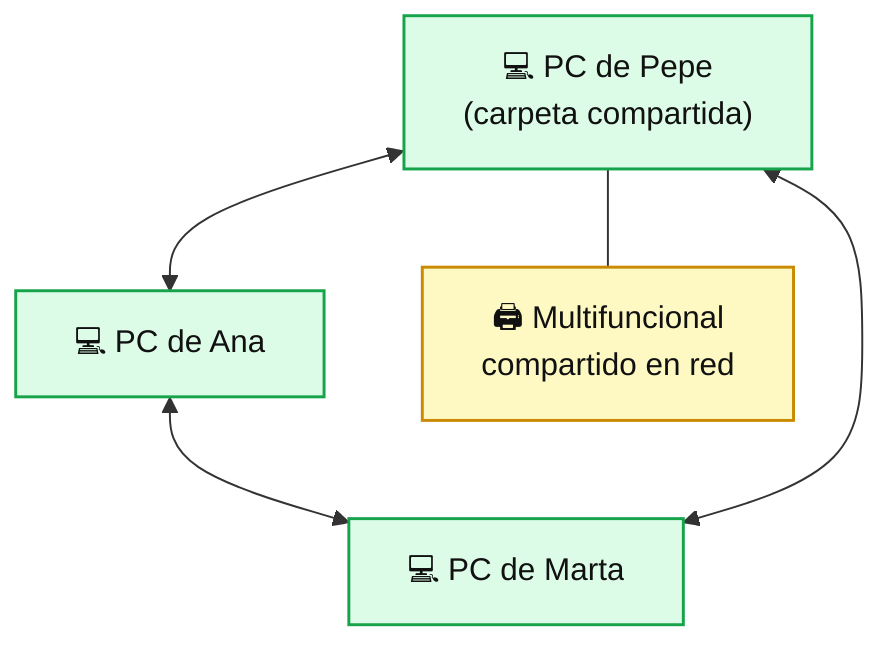
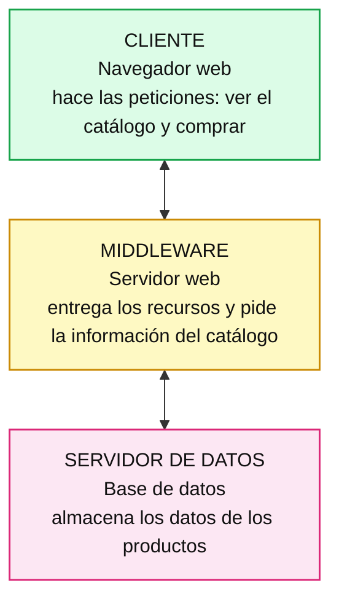

# Casos Prácticos — 1. Introducción a los Sistemas Operativos en Red

---

## Caso Práctico 1 — Asesoría informática

**Planteamiento:** antes de decidir qué sistema operativo en red instalar, hay que tener claro si se va a implementar un servidor o basta con un grupo de trabajo. Cada arquitectura satisface necesidades distintas de seguridad, número de equipos y número de usuarios.

**Nudo:** Pepe y sus dos hermanas acaban de iniciar un negocio de fotografía. Cada uno tiene su propio ordenador, pero tienen problemas para compartir las fotografías y solo pueden imprimir desde el ordenador de Pepe: cada vez que sus hermanas quieren usar el multifuncional, tienen que interrumpirle. Además, se pasan las fotografías por correo y sus buzones están llenos. **¿Qué tipo de arquitectura de red les recomendarías?**

💡 Ver solución

La arquitectura recomendada es un **grupo de trabajo**, por dos razones:

- **El número de usuarios y de equipos es pequeño** (3 personas, 3 ordenadores).
- **La seguridad no es determinante:** solo quieren compartir fotografías, no datos sensibles.

Con un grupo de trabajo, Pepe y sus hermanas pueden:

- Compartir las fotografías mediante una **carpeta compartida**, sin llenar los buzones de correo.
- Compartir el **multifuncional** para que cada uno imprima desde su ordenador sin interrumpir a los demás.

No hace falta implantar un servidor. Eso sí, si el negocio creciera (más empleados, clientes con fotografías que contienen datos personales, necesidad de copias de seguridad centralizadas...), habría que replantearse pasar a una arquitectura cliente/servidor.

---

## Caso Práctico 2 — Asesoría informática 2

**Planteamiento:** existen tres tipos de arquitectura cliente/servidor: de dos niveles, de tres niveles y de N niveles. Hay que saber identificar cuál conviene según el contexto.

**Nudo:** Noé va a iniciar un negocio de venta de ropa en línea. Necesita una página web que muestre el catálogo a sus clientes y les permita comprar. Su almacén es bastante amplio, así que una base de datos resulta indispensable. **¿Qué arquitectura cliente/servidor le recomendarías?**

💡 Ver solución

Se recomienda una arquitectura de **tres niveles**, porque se identifican tres capas claras:

1. **Cliente:** el navegador web desde el que los compradores acceden a la página y adquieren la ropa.
2. **Middleware:** el servidor web, que entrega los recursos al cliente a través de la página y solicita al servidor de datos la información del catálogo.
3. **Servidor de datos:** la última capa, donde reside la base de datos con toda la información del almacén.

Si en el futuro se añadieran servicios especializados (pasarela de pagos, gestión de envíos, control de stock...), la arquitectura evolucionaría hacia **N niveles**.

---

### Caso Práctico 3 — Decidir la arquitectura de red: grupo de trabajo o cliente/servidor

**Situación:** una clínica dental tiene 12 equipos: 4 en recepción y administración y 8 en las consultas. Guardan **historiales clínicos** de pacientes, comparten 2 impresoras y quieren que cada trabajador acceda solo a la información que le corresponde.

💡 Ver solución

**Paso a paso.** Aplicamos los tres criterios del tema:

| Criterio | Análisis | Apunta a... |
|---|---|---|
| **Seguridad** | Datos de salud (categoría especial en el RGPD) y acceso diferenciado por persona | Cliente/servidor |
| **Número de usuarios** | Unos 12 y con posibilidad de crecer | Cliente/servidor |
| **Cantidad de equipos** | 12 equipos, en varias zonas | Cliente/servidor |

**Conclusión:** arquitectura **cliente/servidor**, con un servidor que centralice las cuentas de usuario, los archivos con los historiales y las impresoras.

**Y el sistema operativo del servidor:** ahora se aplicarían los diez factores. Por ejemplo, si el programa de gestión de la clínica solo funciona sobre Windows, el factor *compatibilidad con aplicaciones* inclinaría la balanza hacia **Windows Server**; si no hubiera esa limitación y el presupuesto fuese ajustado, **Ubuntu Server** (sin licencia) sería una opción muy razonable.

> 💡 Fíjate en el orden de las decisiones: **1º** ¿hace falta servidor? **2º** ¿qué sistema? **3º** ¿lo aguanta el hardware? Saltarse el primer paso lleva a instalar servidores donde no hacen falta (o a no instalarlos donde sí).

