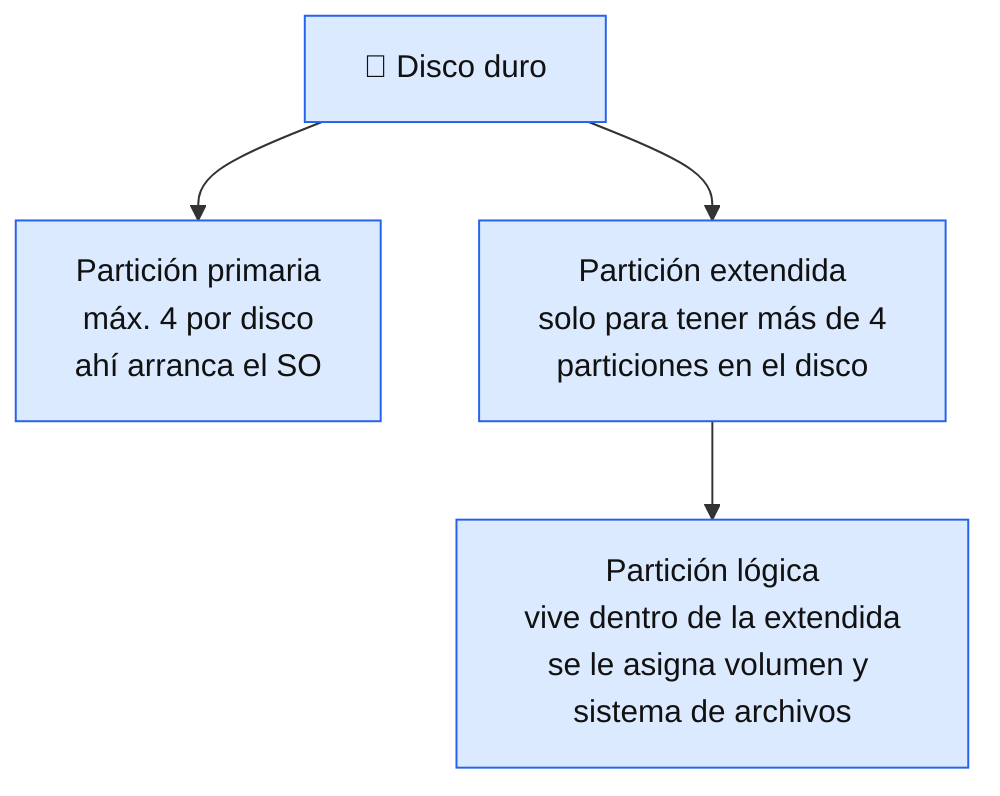
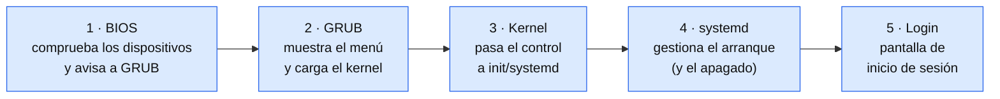
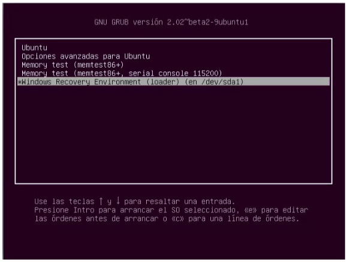
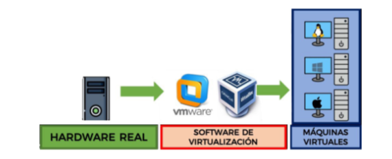
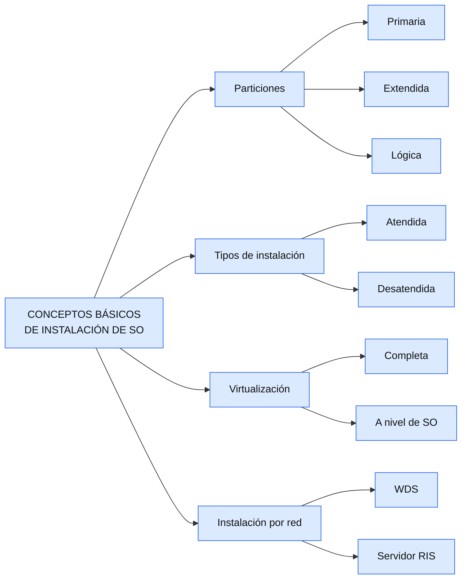

# Tema 2 — Conceptos básicos de instalación de SO

---

## Índice

1. [Introducción y contextualización práctica](#1-introducción-y-contextualización-práctica)
2. [Particiones y sistema de archivos](#2-particiones-y-sistema-de-archivos)
3. [Gestores de arranque](#3-gestores-de-arranque)
4. [Tipos de instalación](#4-tipos-de-instalación)
   - 4.1. [Instalación atendida](#41-instalación-atendida)
   - 4.2. [Instalación desatendida](#42-instalación-desatendida)
5. [Creación de una imagen personalizada](#5-creación-de-una-imagen-personalizada)
   - 5.1. [Creación de una imagen maestra en Linux](#51-creación-de-una-imagen-maestra-en-linux)
   - 5.2. [Creación de una imagen maestra con Rufus](#52-creación-de-una-imagen-maestra-con-rufus)
6. [Virtualización](#6-virtualización)
   - 6.1. [Ventajas e inconvenientes de la virtualización](#61-ventajas-e-inconvenientes-de-la-virtualización)
   - 6.2. [Creación de una máquina virtual](#62-creación-de-una-máquina-virtual)
7. [Instalación en red](#7-instalación-en-red)
   - 7.1. [Servicios de implementación de Windows (WDS)](#71-servicios-de-implementación-de-windows-wds)
   - 7.2. [Servidor RIS](#72-servidor-ris)
8. [Resumen y resolución del caso práctico de la unidad](#8-resumen-y-resolución-del-caso-práctico-de-la-unidad)

---

## 1. Introducción y contextualización práctica

Ya sabes qué es un SO en red y cómo elegirlo. Ahora toca el **paso siguiente**: prepararte para instalarlo. En este tema ves los conceptos que usarás en cualquier instalación, sea Windows Server o Linux: cómo se organiza el disco, cómo arranca el sistema, qué tipos de instalación existen y qué es una máquina virtual.

> 💡 En los temas siguientes verás estos mismos conceptos **aplicados**, primero a la instalación de Windows Server y después a la de un servidor libre.

---

## 2. Particiones y sistema de archivos

Una **partición** es una división de un disco que se comporta como un disco independiente. Sirve, por ejemplo, para separar el sistema operativo de los datos.

> 💡 **Sabías que...** tener varias particiones es como tener varios discos duros dentro de uno físico: cada una con su propio sistema de archivos.

El **sistema de archivos** organiza cómo se escriben, buscan, leen y borran los ficheros en el disco.

| | Windows Server | Linux |
|---|---|---|
| Sistema de archivos habitual | **NTFS** (también existen FAT32, exFAT, ReFS) | ext2, ext3, **ext4**, ReiserFS, FAT, FAT32, NTFS |
| Estructura | Por unidades (`C:`, `D:`...) | **Jerárquica**, desde la raíz `/` |

**Estructura de directorios en Linux** (los más importantes):

| Directorio | Contiene |
|---|---|
| `/` (root) | Directorio principal, del que cuelga todo lo demás |
| `/bin` | Ejecutables esenciales del sistema (`cp`, `mv`, `mkdir`...) |
| `/boot` | Ficheros de arranque: kernel, GRUB |
| `/dev` | Ficheros de dispositivos (USB, discos...) |
| `/etc` | Ficheros de configuración del sistema y de red |
| `/home` | Perfil y datos de cada usuario |
| `/var` | Logs del sistema |

> 💡 En Linux, la raíz (`/`) **es** la partición primaria donde está instalado el SO.

---

## 3. Gestores de arranque

Un **gestor de arranque** (*bootloader*) es el programa que se carga al arrancar el equipo. Cuando hay más de un SO instalado, muestra un menú para elegir cuál cargar.

| | Windows Server | Linux |
|---|---|---|
| Dónde vive | En una partición creada durante la instalación, con la info de arranque y recuperación | En `/boot` |
| Gestores | (integrado en el instalador) | **GRUB** y LILO (GRUB es el más usado) |

**Proceso de arranque de Linux, por etapas:**

---

## 4. Tipos de instalación

Dos ejes distintos: **dónde** se hace y **cuánta atención** requiere.

| | Descripción |
|---|---|
| **Local** | El administrador está físicamente en el servidor. |
| **En red / remota** | Se hace desde otra ubicación, a través de la red. |
| **Atendida** | El usuario va siguiendo los pasos del asistente. |
| **Desatendida** | Se configura antes y se instala sola, sin intervención. |

### 4.1. Instalación atendida

Formas de arrancar el instalador: desde **USB**, desde **DVD**, o desde otro SO ya iniciado ejecutando el instalador.

> 💡 En cualquiera de los casos se usa un **archivo ISO**: contiene el sistema de archivos completo del SO (arranque, configuración, paquetes), y usa la extensión `.iso` o `.img`.

### 4.2. Instalación desatendida

Se crea antes un **archivo de respuestas** (en Windows, en formato XML) para que el sistema se instale solo, sin que nadie esté delante. Se usa mucho en servidores, máquinas virtuales, restauración del SO o al instalar una imagen personalizada.

---

## 5. Creación de una imagen personalizada

Una **imagen maestra** (*master*) es una copia completa de un SO, lista para instalarse por red en otros equipos. Puede ser una copia exacta o personalizada (archivos, kernel, fondo, repositorios...).

### 5.1. Creación de una imagen maestra en Linux

Con el SO **apagado** (para copiar todo tal cual quedó configurado), con la herramienta **Discos** de Ubuntu:

1. Abrir la herramienta *Discos*.
2. Seleccionar el disco donde se guardará la imagen.
3. Crear la partición para la imagen, indicando nombre y ubicación.
4. Comprobar que la imagen se ha creado.

> 💡 Para personalizar imágenes de Linux existen herramientas como **Cubic**.

### 5.2. Creación de una imagen maestra con Rufus

**Rufus** crea un USB de arranque desde un archivo ISO. Necesitas: el `.iso` del SO, un USB de **8 GB mínimo**, y la propia herramienta Rufus (Windows).

1. Descarga la ISO desde la página **oficial** del SO.
2. Descarga **Rufus** desde su página oficial.
3. Selecciona el USB y el tipo de arranque: **"Disco o imagen ISO"**.

---

## 6. Virtualización

**Virtualización:** compartir e imitar el hardware de un equipo para crear varios SO independientes en la misma máquina física, mediante software de virtualización.

| Tipo | Qué hace |
|---|---|
| **De servidores** | Refuerza los servidores físicos de la organización. |
| **De aplicaciones** | Separa las aplicaciones del SO. |
| **De clientes (o de escritorio)** | Aprovecha la arquitectura cliente/servidor para reducir el nº de PC físicos. |

**Tres formas de virtualizar servidores:**

| Tipo | Cómo funciona |
|---|---|
| **Completa** (modelo de máquina virtual) | Necesita un **hipervisor**, que mantiene los SO separados. Requiere más potencia. |
| **Paravirtualización** (PVM) | Los servidores virtuales se coordinan e identifican entre sí. |
| **A nivel de SO** | Un único SO anfitrión con servidores virtuales invitados compartiendo el mismo kernel; más eficiente. |

### 6.1. Ventajas e inconvenientes de la virtualización

| ✅ Ventajas | ⚠️ Inconveniente |
|---|---|
| **Rendimiento:** una máquina física crea varias virtuales | Los recursos disponibles **bajan** según crece el nº de VM |
| **Seguridad:** recuperación rápida desde copias de seguridad | Por eso hay que **elegir bien los requisitos mínimos** de cada VM |
| **Coste:** menos infraestructura, electricidad y refrigeración | |
| **Gestión:** control centralizado de los entornos virtuales | |

### 6.2. Creación de una máquina virtual

Una **máquina virtual (VM)** es un SO virtual: cumple las mismas funciones que uno físico, y es totalmente autónoma. Varias VM en un mismo equipo permiten ejecutar varios SO sobre un solo servidor físico (el **host**).

| Software | Tipo |
|---|---|
| **VirtualBox** | Libre |
| **VMware** (Workstation, Fusion...) | Propietario |

**Pasos generales para crear una VM:**

1. Crear la máquina virtual en el programa de virtualización.
2. Añadir la imagen **ISO** del SO.
3. Configurar los **requisitos mínimos** (CPU, RAM, disco) del SO que se va a instalar.
4. Arrancar la VM para iniciar la instalación.

> 💡 Aquí conectas con el Tema 1: los requisitos que configures en la VM son los que comprobaste en la tabla de requisitos mínimos.

---

## 7. Instalación en red

Instalación que usa un **recurso de red** (una carpeta compartida) o que se hace **desde otro equipo** de la red (instalación remota).

> 💡 Una **VLAN** (*Virtual Local Area Network*) crea redes lógicas independientes dentro de una misma red física, y también puede usarse para desplegar SO por red.

### 7.1. Servicios de implementación de Windows (WDS)

**WDS** (Windows Deployment Services) es la herramienta de Windows Server para **instalar el SO por red** en equipos que arrancan desde red mediante **PXE** (sin USB ni DVD): basta un cable Ethernet o wifi.

> 💡 PXE (Preboot Execution Environment): protocolo que permite que un equipo arranque desde la red, en vez de desde un disco, USB o DVD. La tarjeta de red del cliente, antes de que exista ningún SO, pide una IP y llama a un servidor preguntando si tiene algo que instalarle. WDS es el servidor de Windows que responde a esa llamada PXE, y es quien le envía la imagen del sistema operativo.

**Requisitos:**
- Dominio con **Active Directory Domain Services**.
- Servidor con **dos particiones**, una de ellas en **NTFS**.
- Servidor **DHCP** activo (asigna IP a los clientes WDS).

> 💡 Antes de WDS existía RIS (Servicios de Instalación Remota), su predecesor en Windows 2000/2003 Server; hoy está descontinuado y WDS es su sustituto directo.

### 7.2. Servidor RIS

**RIS** (Servicios de Instalación Remota): permite que equipos con Windows arranquen **por red**, usando un entorno previo al arranque (**PXE**) configurable desde la BIOS. Automatiza la instalación y configuración con una arquitectura cliente/servidor.

**Requisitos:** disco con dos particiones (una NTFS), dominio activo, espacio suficiente para las imágenes y **DHCP** habilitado.

**Configuración (resumen):** ejecutar `risetup.exe` → elegir unidad y servidor → configurar compatibilidad de clientes → elegir la ubicación de las imágenes → nombrar la carpeta y describir la imagen.

| | WDS | RIS |
|---|---|---|
| Estado | Herramienta actual de Windows Server | Predecesor de WDS |
| Necesita | AD DS, NTFS, DHCP | AD activo, NTFS, DHCP |

---

## 8. Resumen y resolución del caso práctico de la unidad

> **Lo esencial del tema**
> - Un disco se divide en **particiones**: primaria, extendida y lógica.
> - El **gestor de arranque** (bootloader) elige qué SO cargar cuando hay varios instalados.
> - Instalación **atendida** (sigues los pasos) o **desatendida** (automática, con archivo de respuestas).
> - Una **imagen maestra** es una copia del SO lista para desplegar en otros equipos.
> - La **virtualización** permite ejecutar varios SO en un mismo equipo físico.
> - La **instalación en red** despliega el SO a otros equipos sin USB ni DVD (WDS, RIS).

