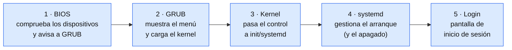

# Casos Prácticos — 2. Conceptos básicos de instalación de SO

---

## Caso Práctico 1 — Proceso de arranque

**Planteamiento:** el proceso de arranque del sistema operativo Linux se carga en diferentes etapas.

**Nudo:** identifica cuáles son esas etapas y descríbelas.

💡 Ver solución

El proceso de arranque de un SO Linux se carga por **etapas**:

1. **BIOS:** se carga al iniciar, comprueba los dispositivos disponibles y envía la información al gestor de arranque (GRUB).
2. **GRUB:** muestra el menú de inicio para elegir el SO y carga el kernel en memoria.
3. **Kernel:** transfiere el proceso de arranque a `init`/`systemd`.
4. **systemd:** gestiona el arranque del SO (y también el apagado).
5. **Login:** aparece la pantalla de inicio de sesión.

---

## Caso Práctico 2 — Rufus

**Planteamiento:** Rufus es una aplicación que crea imágenes para instalar un SO desde un medio extraíble (USB).

**Nudo:** para entender cómo funciona Rufus, hay que instalarlo y hacer una prueba.

💡 Ver solución

**Paso 1:** descargar Rufus desde su **página oficial**: [rufus.ie](https://rufus.ie/)

**Paso 2:** en la sección de descarga, elegir la versión según el sistema operativo (Windows/portable).

**Paso 3:** el proceso de instalación es sencillo: seguir los pasos del asistente.

Una vez instalado, para crear el USB de arranque:

1. Conectar el USB (mínimo **8 GB**).
2. Seleccionar el archivo **.ISO** del SO descargado desde su página oficial.
3. Seleccionar la unidad USB correspondiente.
4. Elegir el tipo de arranque: **"Disco o imagen ISO"**.
5. Grabar la imagen.

Ya tienes el USB. Ahora hay que arrancar la instalación desde él:

6. Conectar el USB al equipo donde se va a instalar el SO y encenderlo.
7. Entrar en la BIOS/UEFI (la tecla depende del fabricante: F2, F10, F12, Supr...) o abrir el menú de arranque, y poner el USB como primer dispositivo de arranque (boot order).
8. Guardar los cambios y salir. El equipo arranca desde el USB y aparece el asistente de instalación.

> 💡 Si el USB no aparece como opción de arranque, revisa que el modo de la BIOS/UEFI (UEFI o Legacy) coincida con el esquema de partición que elegiste en Rufus (GPT para UEFI, MBR para BIOS/Legacy).

> 💡 Con este mismo procedimiento se puede crear, por ejemplo, un USB de arranque de **Ubuntu Server** desde Windows.

