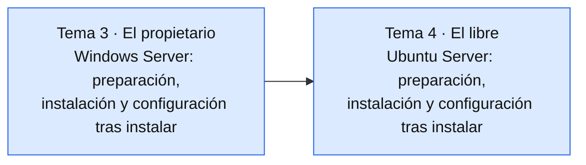

# Bloque 2 — Instalación y explotación básica de servidores

2º SMR | Sistemas Operativos en Red | 1er Trimestre

## Temas

- [**Tema 3:** Instalación y explotación básica de SO de servidor propietarios](tema03/apuntes.md)
- **Tema 4:** Instalación y explotación básica de SO de servidor libres *(pendiente)*

---

## ¿Qué vamos a ver en este bloque?

Ponemos en práctica lo del Bloque 1: primero con un SO de servidor **propietario** (Windows Server) y después con uno **libre** (Ubuntu Server). En el Tema 3, la instalación en sí ya la hicisteis en la práctica del Tema 2; aquí nos centramos en lo que viene después: personalizar el servidor, darle IP fija, revisar el cortafuegos, mantenerlo actualizado y documentarlo.

