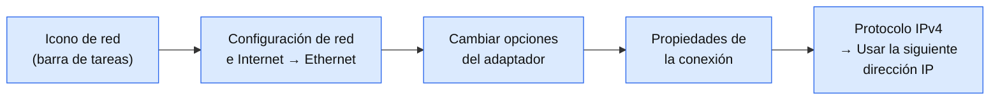
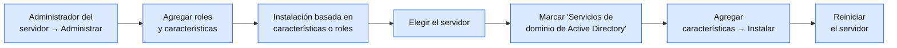
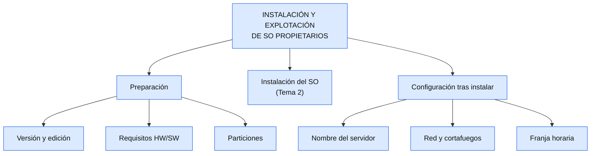

# Tema 3 — Instalación y explotación básica de SO de servidor propietarios

---

## Índice

1. [Introducción y contextualización práctica](#1-introducción-y-contextualización-práctica)
2. [Preparación de la instalación](#2-preparación-de-la-instalación)
   - 2.1. [Versiones del sistema operativo](#21-versiones-del-sistema-operativo)
   - 2.2. [Requisitos de software y hardware](#22-requisitos-de-software-y-hardware)
   - 2.3. [Particiones y sistema de archivos](#23-particiones-y-sistema-de-archivos)
3. [Instalación local del sistema operativo](#3-instalación-local-del-sistema-operativo)
4. [Configuración tras la instalación](#4-configuración-tras-la-instalación)
   - 4.1. [Personalización del entorno servidor](#41-personalización-del-entorno-servidor)
   - 4.2. [Configuración de red](#42-configuración-de-red)
5. [Conexión con equipos clientes](#5-conexión-con-equipos-clientes)
6. [Configuración del cortafuegos](#6-configuración-del-cortafuegos)
7. [Actualizaciones del servidor](#7-actualizaciones-del-servidor)
8. [Problemas durante la instalación](#8-problemas-durante-la-instalación)
9. [Documentación de la instalación](#9-documentación-de-la-instalación)
10. [Resumen y resolución del caso práctico de la unidad](#10-resumen-y-resolución-del-caso-práctico-de-la-unidad)

> 🎯 **Lo esencial del tema**
> - Antes de instalar: elegir **versión y edición**, comprobar **requisitos** y decidir las **particiones**.
> - La instalación en sí **ya la hicisteis** en la práctica del Tema 2 (fue el adelanto de este tema).
> - Lo nuevo de aquí: **personalizar** el servidor, preparar la conexión con **clientes**, revisar el **cortafuegos**, mantenerlo **actualizado** y **documentarlo** todo.

---

## 1. Introducción y contextualización práctica

Un sistema operativo **propietario** usa código fuente privado, de una empresa, para uso comercial. En este tema nos centramos en **Windows Server**, concretamente en la versión **2019**.

> 💡 Este tema explica **preparar e instalar** Windows Server (apartados 2 y 3). Esa parte **ya la trabajasteis en la práctica del Tema 2**: creasteis la VM, hicisteis el experimento de particiones y la instalasteis hasta el primer inicio de sesión. Aquí lo repasamos muy por encima y nos centramos en lo que viene **después**: configurar, conectar clientes y mantener el servidor.

---

## 2. Preparación de la instalación

### 2.1. Versiones del sistema operativo

El primer Windows Server se lanzó en 2000. Estas son sus versiones:

| Año | Versión |
|---|---|
| 2000 | Windows 2000 Server |
| 2003 | Windows Server 2003 |
| 2008 | Windows Server 2008 |
| 2009 | Windows Server 2008 R2 |
| 2012 | Windows Server 2012 |
| 2013 | Windows Server 2012 R2 |
| 2016 | Windows Server 2016 |
| 2018 | **Windows Server 2019** ← la que usamos |
| 2021 | Windows Server 2022 |
| 2024 | Windows Server 2025 |

**Ediciones de Windows Server 2019:**

| Edición | Para quién | Virtualización |
|---|---|---|
| **Essentials** | Pequeñas empresas, coste bajo | No permite |
| **Standard** | Empresas con poca virtualización | Hasta 2 VM |
| **Datacenter** | Centros de datos | Ilimitada |

### 2.2. Requisitos de software y hardware

Los requisitos mínimos **oficiales** de Windows Server 2019:

| Componente | Mínimo |
|---|---|
| Procesador | 1,4 GHz, 64 bits |
| RAM | 512 MB (Server Core) · **2 GB** con interfaz gráfica |
| Disco | 32 GB |
| Red | Adaptador Ethernet de 1 gigabit |

> 💡 Recuerda (Tema 1): el mínimo solo permite instalar y arrancar; para ir fluido conviene más margen. 

### 2.3. Particiones y sistema de archivos

Se recomiendan **dos particiones**: una para el **sistema operativo y las aplicaciones**, y otra para **datos**. Así, si hay que reinstalar o formatear, los datos no se pierden. Se formatean con **NTFS** (el recomendado para Windows Server; FAT/FAT32 solo por compatibilidad con sistemas antiguos).

👉 Esto es justo lo que hicisteis en el Tema 2: una partición para el SO (~40 GB) y otra para datos.

---

## 3. Instalación local del sistema operativo

> ✅ **Ya hecho.** Crear la máquina virtual e instalar Windows Server 2019 paso a paso (edición, licencia, tipo de instalación, partición, contraseña de Administrador, primer inicio con `Ctrl+Alt+Supr`) es exactamente lo que hicisteis en la práctica del Tema 2. 

El libro usa VMware para los pantallazos, pero el proceso con **VirtualBox** (el que usamos nosotros) es el mismo: crear la VM, indicarle la ISO, y seguir el asistente del instalador.

---

## 4. Configuración tras la instalación

### 4.1. Personalización del entorno servidor

Desde **Inicio → Administrador del servidor** se configuran los aspectos iniciales del servidor.

| Qué cambiar | Dónde |
|---|---|
| **Nombre del equipo** (y grupo de trabajo/dominio) | Administrador del servidor → **Servidor local** → clic en el nombre actual |
| **Fecha, hora y zona horaria** | Panel de control → **Configurar la hora y la fecha** |

> 💡 El nombre es importante: es como el servidor **se identifica en la red**. Al cambiarlo, pide reiniciar.

### 4.2. Configuración de red

Lo habitual en un servidor es fijar una **IP estática** (dirección IP, máscara y puerta de enlace fijas), para que no cambie en cada arranque y sea fácil de localizar.

En **Protocolo de Internet versión 4 (TCP/IPv4)**: marcar "Usar la siguiente dirección IP" e indicar la IP, la máscara, la puerta de enlace y el DNS.

---

## 5. Conexión con equipos clientes

Para que equipos clientes se conecten de forma gestionada, hace falta **Active Directory Domain Services** (lo veremos en detalle en el Bloque de Dominios). Permite crear y administrar usuarios, equipos y permisos de forma centralizada y remota.

**Instalación, resumida:**

---

## 6. Configuración del cortafuegos

Windows Server trae **Windows Defender Firewall**, activado por defecto, para impedir accesos no deseados.

📍 Panel de control → Sistema y seguridad → **Firewall de Windows Defender**

| Qué puedes hacer | Para qué |
|---|---|
| Permitir una app a través del firewall | Elegir si se permite con red pública, privada, o ambas |
| Activar/desactivar por tipo de red | Lo ideal: **activo en pública y privada** |
| Configuración avanzada | Crear reglas de entrada o salida concretas |

---

## 7. Actualizaciones del servidor

Mantener el servidor actualizado es necesario para que funcione bien y de forma segura.

📍 Inicio → Configuración → **Actualización y seguridad** (Windows Update)

- Se puede activar **"Descargar automáticamente las actualizaciones"** (Opciones avanzadas).
- Se pueden fijar **"horas activas"**, para que las actualizaciones no reinicien el servidor en horario de uso.

**Cambiar de versión:** se descarga la ISO de la versión nueva, se ejecuta el asistente y se elige **"Actualizar"** en vez de instalación limpia. También se puede pasar de **evaluación a comercial** introduciendo la licencia, sin perder la configuración.

---

## 8. Problemas durante la instalación

| Problema | Causa probable |
|---|---|
| Sin conexión a Internet | La tarjeta de red de la VM no está bien configurada |
| El servidor va lento | Poca RAM asignada a la VM |
| No reconoce un dispositivo | El dispositivo puede estar dañado |
| No hay licencia | Se puede usar la **versión de evaluación** (180 días) mientras se decide |

> 💡 **Informe de errores de Windows:** por defecto, Windows envía automáticamente un informe a Microsoft cuando ocurre un error. Se configura en Panel de control → Sistema y seguridad → Seguridad y mantenimiento → Mantenimiento.

---

## 9. Documentación de la instalación

Documentar la instalación ayuda a resolver problemas futuros y a que **cualquier administrador** entienda el sistema con solo leer el documento. Debería incluir:

| Apartado | Qué anotar |
|---|---|
| **Hardware** | Equipo, procesador, RAM, tarjeta de red, disco |
| **Dispositivos conectados** | Impresoras, escáneres... |
| **Sistema operativo** | Nombre, versión, edición, fecha de instalación, usuario instalador |
| **Software adicional** | Antivirus, cortafuegos u otro software instalado |
| **Red** | IP fija, máscara, puerta de enlace |

Las **incidencias** (problemas que surgen durante el uso) también se anotan, junto con su solución. Para Windows Server, Microsoft ofrece soporte en [support.microsoft.com/es-es/contactus](https://support.microsoft.com/es-es/contactus).

---

## 10. Resumen y resolución del caso práctico de la unidad

---

## Bibliografía

- Jang, M. y Zinkann, E. (2009). *Ubuntu server administration*. McGraw-Hill.
- Hagman, S. e Indiresh, K. (2015). *Sistemas Operativos Libres y Propietarios: Comparación Directa*. Revista Antioqueña de las Ciencias Computacionales, 5(1).
- Pérez, J. C., Carballeira, F. G., de Miguel Anasagasti, P. y Costoya, F. P. (2001). *Sistemas operativos*. McGraw-Hill Interamericana.
- Thomas, O. (2020). *Windows Server 2019 Inside Out*. Microsoft Press.

**Enlaces útiles:** [Requisitos de hardware de Windows Server](https://learn.microsoft.com/es-es/windows-server/get-started/hardware-requirements) · [Soporte de Microsoft](https://support.microsoft.com/es-es/contactus)
